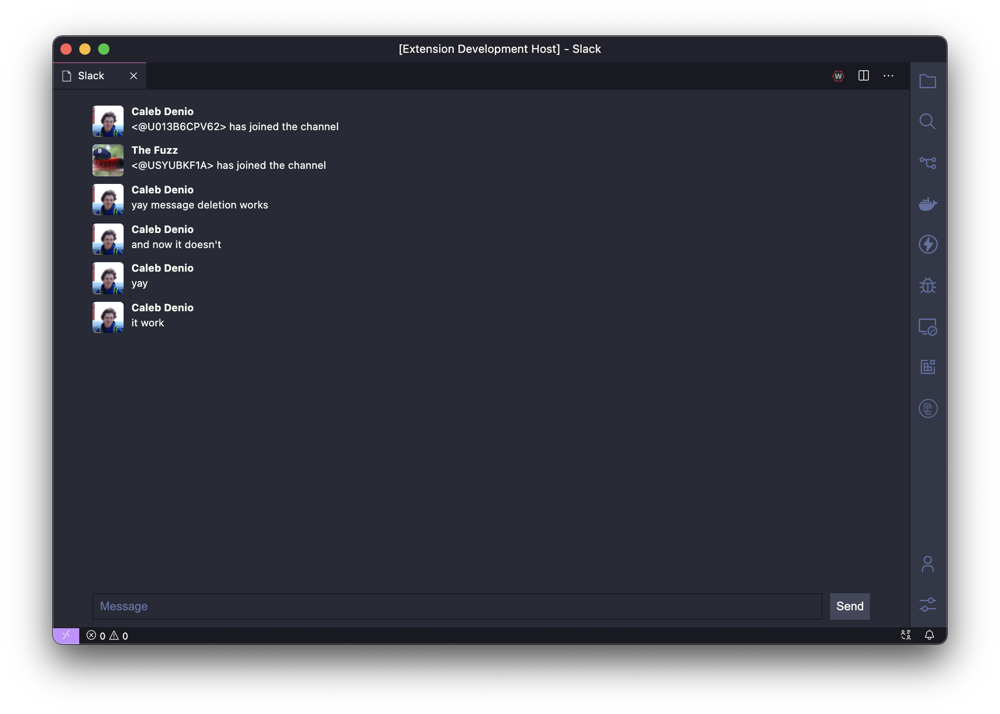

# vs-slack

Slack integration for VS Code.

## Project status

vs-slack is usable, though not stable or done by any means.

## Usage

First, log in to Slack with `vs-slack: Log in to Slack`. Next, open the chat with `vs-slack: Open Slack`!
